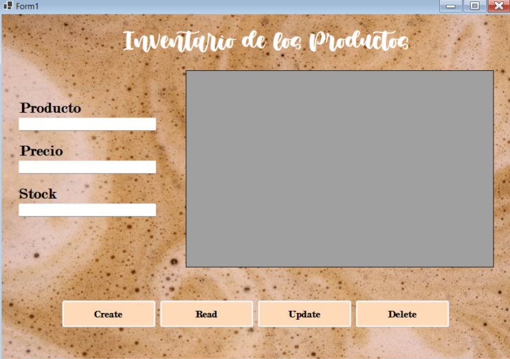

# DOCUMENTACIÓN DE PROYECTO ESCOLAR
## Sistema de Gestión de Productos (CRUD Supermercado)

**Colegio:** Apec Fernando Arturo de Meriño 
**Curso:** 5to Año - Técnico en Informática  
**Asignatura:** Desarrollo de Aplicaciones y Bases de Datos  
**Autor:** Arianna Lizbeth Cedeño Belliard
**Fecha:** Junio 2026  

## Índice
1. [Descripción del Proyecto](#descripción-del-proyecto)
2. [Arquitectura y Tecnologías](#arquitectura-y-tecnologías)
3. [Estructura de la Base de Datos](#estructura-de-la-base-de-datos)
4. [Windows Form (Visualización del CRUD)](#windows-form-visualización-del-crud)
5. [Conclusiones](#conclusiones)

## Descripción del Proyecto

Este proyecto consiste en el desarrollo de una aplicación de escritorio/web que implementa un sistema **CRUD** (Crear, Leer, Actualizar y Eliminar) para la gestión del inventario de un supermercado. 

La aplicación permite a los usuarios administradores interactuar de manera directa con una base de datos centralizada para mantener actualizado el catálogo de productos disponibles en las góndolas.

### Características Principales
* **Diseño Limpio y Estructurado:** Interfaz de usuario simple, sin pestañas ni elementos distractores, priorizando la facilidad de uso.
* **Operaciones CRUD Completas:** Control total sobre los datos de cada producto.
* **Persistencia de Datos:** Conexión segura y directa a la base de datos creada para la realización de la asignación.

## Arquitectura y Tecnologías

Para lograr una estructura eficiente, rápida y profesional, se seleccionaron las siguientes tecnologías:

* **Motor de Base de Datos:** SQL Server
* **Lenguaje de Programación:** C# (.NET)
* **Acceso a Datos / ORM:** Entity Framework Core (EF Core)


## Estructura de la Base de Datos

El núcleo del sistema es la tabla de productos. A continuación se muestra un resumen de las columnas principales que componen el modelo de datos en el servidor:

| Campo | Tipo de Dato | Descripción |
| :--- | :--- | :--- |
| **id** | int (Identity) | Clave primaria autoincrementable |
| **nombre** | varchar(100) | Nombre comercial del producto de supermercado |
| **precio** | decimal(10,2) | Costo de venta al público |
| **stock** | int | Cantidad de unidades disponibles en inventario |

### Inserts realizados a la base de datos durante las pruebas
Para poder hacer la prueba del CRUD se insertaron primero estos datos a la base de datos directamente

```sql
insert into productos (nombre, precio, stock) 
values ('Leche Entera 1L', 75.00, 120);

insert into productos (nombre, precio, stock) 
values ('Arroz Premium 5lb', 240.00, 50);
```
## Windows Form (Visualización del CRUD)



## Conclusiones:
- Dominio de Entity Framework Core: La implementación de DbContext y DbSet facilitó el mapeo directo de la tabla de SQL Server a objetos de C#, eliminando la necesidad de escribir consultas manuales complejas en el código de la interfaz.

- Manejo de Instancias Locales: Se comprendió la configuración práctica de cadenas de conexión seguras utilizando autenticación integrada (Trusted_Connection=True) conectando directamente a una instancia local de SQLEXPRESS.

- Optimización del Diseño: El desarrollo enfocado en una única entidad clara permitió pulir la lógica del CRUD antes de escalar el software a un modelo de negocio con más catálogos.

